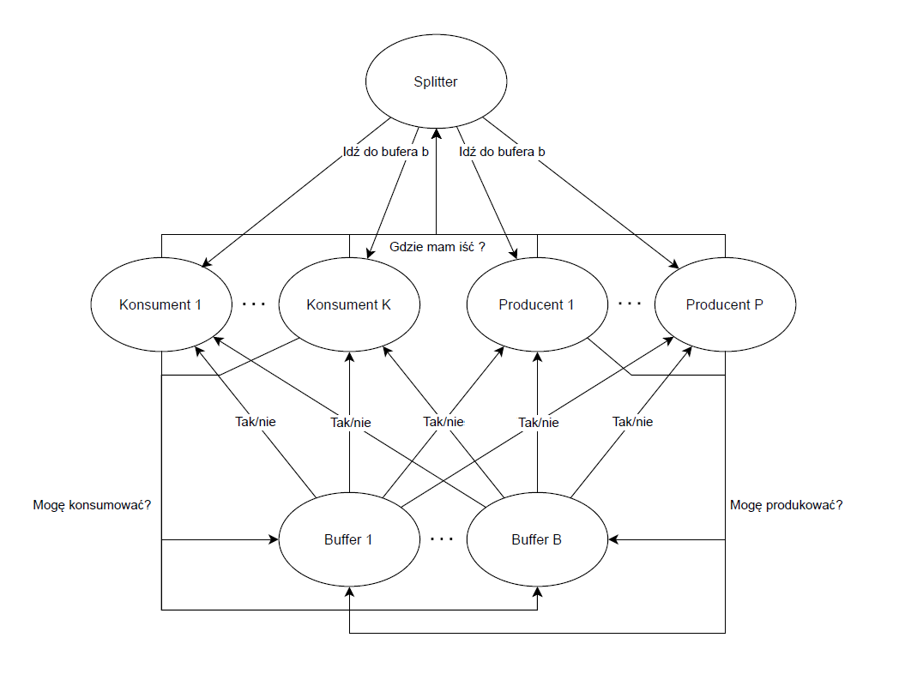

# Concurrency Theory JSCP

Consumer and producer problem using CSP with distributed buffer.
Solution made for concurrency theory course in AGH UST.
Solution use [JSCP](https://www.cs.kent.ac.uk/projects/ofa/jcsp/) library.

The scheme of communication is below:

Each consumer or producer (agent) in order to perform an operation on one selected buffer asks Splitter where to go.
When he got answer he sends a message to selected buffer and get positive or negative reply. 
On a positive reply we assume that message was accepted and buffer gave or take a portion of data.
On negative reply agent waits a while and asks again the same buffer. If he got three times negative answer he goes back to Splitter and asked for other buffer. 